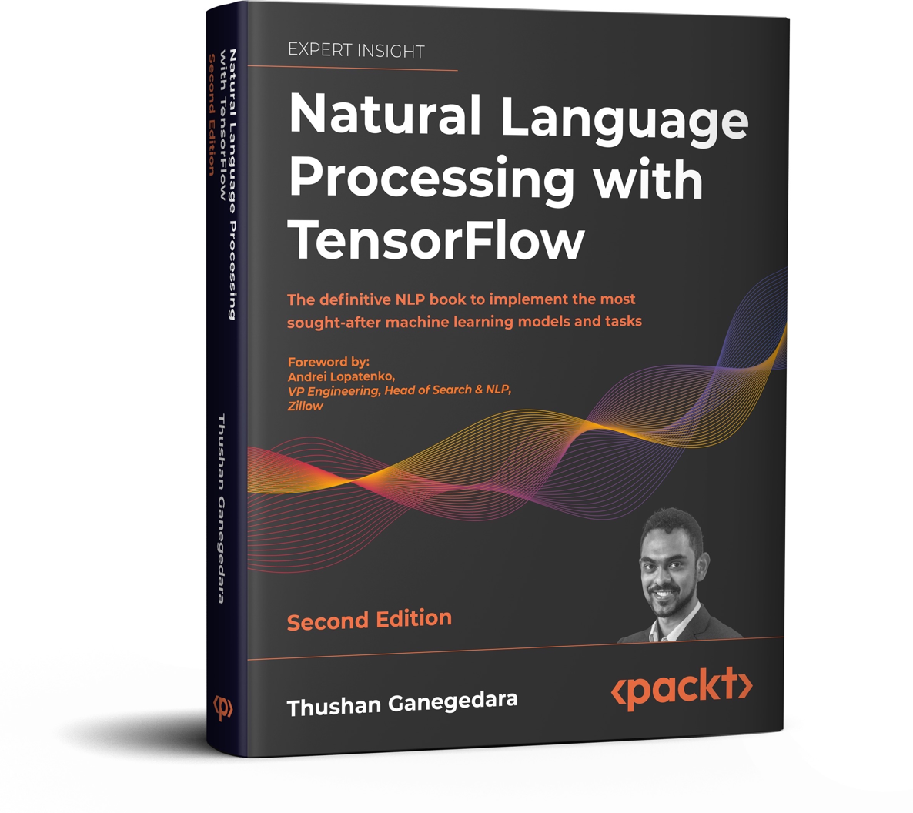

# Natural Language Processing with TensorFlow-2nd-Edition

Copyright © 2022 Packt Publishing, Thushan Ganegedara

 This project is the code repository for [NLP with TensorFlow 2.0 - Edition 2]().

## Getting Started

You can run these notebooks on cloud platforms like Google Colab or your local machine. Note that some chapters require a GPU to run in a reasonable amount of time, so we recommend one of the cloud platforms as they come pre-installed with CUDA.

| Chapters | Colab | Kaggle | Gradient | StudioLab |
| :-------- | :-------- | :-------| :------- |:------- |
| Understanding TensorFlow 2 <ul><li>tensorflow_introduction.ipynb</li></ul> |  |  |  |  |
| Word2vec – Learning Word Embeddings <ul><li>ch3_word2vec.ipynb</li><li>ch3_wordnet.ipynb</li></ul> |   |   |   |   |
| Advanced Word Vector Algorithms <ul><li>ch4_document_classification.ipynb</li><li>ch4_elmo_embeddings.ipynb</li><li>ch4_glove.ipynb</li></ul> |    |    |    |    |
| Sentence Classification with Convolution Neural Networks <ul><li>ch5_cnn_sentence_classification.ipynb</li><li>ch5_image_classification_fashion_mnist.ipynb</li></ul> |   |   |   |   |
| Recurrent Neural Networks <ul><li>ch06_rnns_for_named_entity_recognition.ipynb</li></ul> |  |  |  |  |
| Applications of LSTM – Generating Text <ul><li>ch08_lstms_for_text_generation.ipynb</li></ul> |  |  |  |  |
| Sequence-to-Sequence Learning – Neural Machine Translation <ul><li>ch09_seq2seq.ipynb</li></ul> |  |  |  |  |
| Transformers <ul><li>ch10_transformers.ipynb</li></ul> |  |  |  |  |
| Image captioning with Transformers <ul><li>ch11_image_captions.ipynb</li></ul> |  |  |  |  |
| Appendix <ul><li>tensorboard_word_embeddings.ipynb</li></ul> |  |  |  |  |

## Prerequisites for running the notebooks on your local machine(GPU support)

* Install the latest NVIDIA driver for your GPU from [this page](https://www.nvidia.com/download/index.aspx?lang=en-us)
* Install CUDA 10.2 (TensorFlow 2.3)
* Setup CuDNN
* Make sure your $PATH variable contains the path to the bin folder of cuda (e.g. On Windows - C:\CUDA\v10.2\bin)
  * On UNIX - Set LD_LIBRARY_PATH to `lib64` folder (e.g. `/usr/local/cuda-10.2/lib64`)

## Creating a Virtual Environment (Anaconda) (Recommended)

* Install Anaconda
* Open up Anaconda Prompt
* Setup a conda virtual environment with `conda create -n packt.nlp.2 python=3.6`
* Activate the environment with `conda activate packt.nlp.tf2`
* Install the required libraries using `pip install -r requirements.txt`

## Important notes

* For some plotting capability provided in TensorFlow/Keras, you have installed a Python package called `graphviz`. You might need to add the path to this library (e.g. `<path to Anaconda>\envs\packt.nlp.tf2\Library\bin\graphviz` if you used Anaconda installation)

## Getting Jupyter Notebook server up

Now you are ready to run the Jupyter notebook server, allowing you to run the notebooks provided in the code repository.

* Open up the command line terminal and activate the virtual environment `packt.nlp.tf2` if you haven't already
* Go in to the directory you downloaded code to using `cd` in the CLI (e.g. `cd C:\Users\<user>\Documents\code\packt_nlp_tensorflow_2`)
* Run `jupyter notebook` in the CLI
* This should open up the jupyter notebook server's landing page on your default browser
* Now you can navigate the folder structure within that directory, open any notebook and run it.
